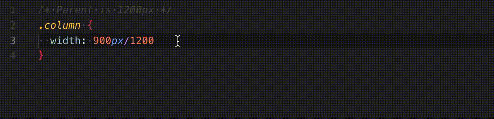

# CSS Responsive extension for visual studio code

Simple yet amazing(!) extension to convert a division to percent for css based files.

## Features

## Requirements

No requirements needed.

## Extension Settings

This extension contributes the following settings:

* `CssResponsive.comments`: if enabled will put the division as comment, default is true.
* `CssResponsive.fixedDigits`: Define the number of decimals, default is 6. (note: the number is rounded)

### 1.0.0

Initial release

### 1.1.0

Handle all css values unit
Handle decimales
Add language syntax specificities (sass, stylus…)
